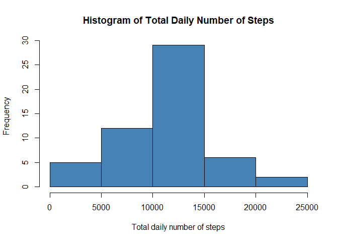

## Loading and preprocessing the data

First, set the global options and turn the warnings off


```r
library(knitr)
opts_chunk$set(fig.path="Figs/", warning = FALSE, message = FALSE, echo = TRUE)
```


1. Load the data (i.e. read.csv())


```r
activity <- read.csv("activity.csv")
names(activity)
```

```
## [1] "steps"    "date"     "interval"
```

```r
head(activity,6)
```

```
##   steps       date interval
## 1    NA 2012-10-01        0
## 2    NA 2012-10-01        5
## 3    NA 2012-10-01       10
## 4    NA 2012-10-01       15
## 5    NA 2012-10-01       20
## 6    NA 2012-10-01       25
```

2. Process/transform the data (if necessary) into a format suitable for your analysis


```r
activity$date <- as.POSIXct(activity$date, "%Y-%m%d")
activity$weekday <- weekdays(activity$date)

summary(activity)
```

```
##      steps             date               interval        weekday         
##  Min.   :  0.00   Min.   :2012-10-01   Min.   :   0.0   Length:17568      
##  1st Qu.:  0.00   1st Qu.:2012-10-16   1st Qu.: 588.8   Class :character  
##  Median :  0.00   Median :2012-10-31   Median :1177.5   Mode  :character  
##  Mean   : 37.38   Mean   :2012-10-31   Mean   :1177.5                     
##  3rd Qu.: 12.00   3rd Qu.:2012-11-15   3rd Qu.:1766.2                     
##  Max.   :806.00   Max.   :2012-11-30   Max.   :2355.0                     
##  NA's   :2304
```

## What is mean total number of steps taken per day?

For this part of the assignment, you can ignore the missing values in the dataset.


```r
#subset the total steps and dates from activity
plot1Data <- data.frame(tapply(activity$steps, activity$date, sum, na.rm=TRUE))
names(plot1Data)[[1]] <- "Total steps"
plot1Data$date <- rownames(plot1Data)
rownames(plot1Data) <- NULL

head(plot1Data,3)
```

```
##   Total steps       date
## 1           0 2012-10-01
## 2         126 2012-10-02
## 3       11352 2012-10-03
```

1. Make a histogram of the total number of steps taken each day

```r
#Histogram of total number of steps taken each day
png("plot1.png")
hist(plot1Data$`Total steps`, main = "Total Number of Steps Taken Per Day", xlab = "Total Steps", col = "steelblue", ylim = c(0,30))
dev.off()
```

```
## png 
##   2
```

```r
#print plot1 here
hist(plot1Data$`Total steps`, main = "Total Number of Steps Taken Per Day", xlab = "Total Steps", col = "steelblue", ylim = c(0,30))
```

<!-- -->

**Note**: If you do not understand the difference between a histogram and a barplot, research the difference between them.  
(*Here is the barplot of total number of steps taken per day*)


```r
#make a barplot using ggplot2 system
library(ggplot2)
png("plot1barplot.png", width = 1080, height = 480)
g1 <- ggplot(aes(y = `Total steps`, x = date), data = plot1Data)
g1 + geom_bar(stat = "identity") + ylab("Total Steps") + xlab("Date") + ggtitle("Total Number of Steps Taken Per Day")
dev.off()
```

```
## png 
##   2
```

```r
#print the barplot here
g1 + geom_bar(stat = "identity") + ylab("Total Steps") + xlab("Date")+ ggtitle("Total Number of Steps Taken Per Day")
```

<!-- -->


2. Calculate and report the mean and median total number of steps taken per day

Here are the mean and median total number of steps taken per day.  
**Note: I set the days that contain no steps as "0" instead of "NA" to calculate the mean and median.**


```r
#Calculate the mean and median
stepsMean <- mean(plot1Data$`Total steps`)
stepsMedian <- median(plot1Data$`Total steps`)

#print the result
paste("The mean of total number of steps taken per day is", stepsMean)
```

```
## [1] "The mean of total number of steps taken per day is 9354.22950819672"
```

```r
paste("And the median of total number of steps taken per day is", stepsMedian)
```

```
## [1] "And the median of total number of steps taken per day is 10395"
```

**Another situation: if I took zero steps as "NA"**


```r
temp <- aggregate(steps~date, activity, sum)
mean2 <- mean(temp$steps)
median2 <- median(temp$steps)

paste("If I took zero steps as NA to calculate the mean and median, then I will get", mean2, "as mean and", median2, "as median.")
```

```
## [1] "If I took zero steps as NA to calculate the mean and median, then I will get 10766.1886792453 as mean and 10765 as median."
```


## What is the average daily activity pattern?

1. Make a time series plot (i.e. type = "l") of the 5-minute interval (x-axis) and the average number of steps taken, averaged across all days (y-axis)


```r
#Calculate the average number of steps taken

plot2Data <- aggregate(steps~interval, activity, mean)

#create and export plot2.png
png("plot2.png", width = 720, height = 480)
with(plot2Data, plot(interval, steps, type = "l", col = "steelblue", lwd = 1.5, xlab = "Interval", ylab = "Average Number of Steps", main = "Average Numbse of Steps Taken Per Interval"))
dev.off()
```

```
## png 
##   2
```

```r
#print the plot2 here
with(plot2Data, plot(interval, steps, type = "l", col = "steelblue", lwd = 1.5, xlab = "Interval", ylab = "Average Number of Steps", main = "Average Numbse of Steps Taken Per Interval"))
```

<!-- -->


2. Which 5-minute interval, on average across all the days in the dataset, contains the maximum number of steps?


```r
intervalMax <- plot2Data[which.max(plot2Data$steps),]$interval

paste("The interval", intervalMax, "contains the maximum number of steps")
```

```
## [1] "The interval 835 contains the maximum number of steps"
```

## Imputing missing values

**Note** that there are a number of days/intervals where there are missing values (coded as NA). The presence of missing days may introduce bias into some calculations or summaries of the data.

1. Calculate and report the total number of missing values in the dataset (i.e. the total number of rows with NAs)


```r
calNA <- activity[which(is.na(activity$steps)), ]
calNA <- nrow(calNA)

paste("There are", calNA, "missing values in the data set.")
```

```
## [1] "There are 2304 missing values in the data set."
```

2. Devise a strategy for filling in all of the missing values in the dataset. The strategy does not need to be sophisticated. For example, you could use the mean/median for that day, or the mean for that 5-minute interval, etc.

**Note**: I decided to fill in all of the missing values in the data set with mean for the 5-minute interval.


```r
stepsPerInterval <- plot2Data
newData <- read.csv("activity.csv")

#fill in the missing values with average steps per interval
for(i in 1:nrow(newData)){
        if (is.na(newData[i, ]$steps)){
                newData[i, ]$steps <- stepsPerInterval[i, ]$steps
        }
}
```

3. Create a new dataset that is equal to the original dataset but with the missing data filled in.


```r
#show the new data generated above
newData$date <- as.POSIXct(newData$date, "%Y-%m%d")
head(newData,6)
```

```
##       steps       date interval
## 1 1.7169811 2012-10-01        0
## 2 0.3396226 2012-10-01        5
## 3 0.1320755 2012-10-01       10
## 4 0.1509434 2012-10-01       15
## 5 0.0754717 2012-10-01       20
## 6 2.0943396 2012-10-01       25
```


4. Make a histogram of the total number of steps taken each day and Calculate and report the **mean** and **median** total number of steps taken per day. Do these values differ from the estimates from the first part of the assignment? What is the impact of imputing missing data on the estimates of the total daily number of steps?


```r
plot3Data <- aggregate(steps~date, data = newData, sum)
#create and export the histogram
png("plot3.png")
hist(plot3Data$steps, col = "steelblue", xlab = "Total daily number of steps", main = "Histogram of Total Daily Number of Steps")
dev.off()
```

```
## png 
##   2
```

```r
#to show the plot here
hist(plot3Data$steps, col = "steelblue", xlab = "Total daily number of steps", main = "Histogram of Total Daily Number of Steps")
```

<!-- -->

Here are the mean and median of the total daily number of steps.


```r
stepsMean2 <- mean(plot3Data$steps)
stepsMedian2 <- median(plot3Data$steps)

paste("The mean total daily number of steps with replaced missing values is", stepsMean2)
```

```
## [1] "The mean total daily number of steps with replaced missing values is 10766.1886792453"
```

```r
paste("The median total daily number of steps with replaced missing values is", stepsMedian2)
```

```
## [1] "The median total daily number of steps with replaced missing values is 10765.5943396226"
```

If I consider to compare the mean and median in question 1 as **mean2** and **median2** (took the steps number zero as "NA" when doing the calculation).  
Then the mean didn't change, but the median has a very little change.

```r
paste("The mean in question 1 is", mean2)
```

```
## [1] "The mean in question 1 is 10766.1886792453"
```

```r
paste("The median in question 1 is", median2)
```

```
## [1] "The median in question 1 is 10765"
```

## Are there differences in activity patterns between weekdays and weekends?

For this part the weekdays() function may be of some help here. Use the dataset with the filled-in missing values for this part.

1. Create a new factor variable in the dataset with two levels -- "weekday" and "weekend" indicating whether a given date is a weekday or weekend day.

```r
#divide the days to weekends and weekdays
newData$day <- weekdays(newData$date)
for (i in 1:nrow(newData)){
        if (newData[i, ]$day %in% c("Saturday", "Sunday")) {
                newData[i, ]$day <- "weekend"
        }else{
                newData[i, ]$day <- "weekday"
        }
}

#show the newData
head(newData,6)
```

```
##       steps       date interval     day
## 1 1.7169811 2012-10-01        0 weekday
## 2 0.3396226 2012-10-01        5 weekday
## 3 0.1320755 2012-10-01       10 weekday
## 4 0.1509434 2012-10-01       15 weekday
## 5 0.0754717 2012-10-01       20 weekday
## 6 2.0943396 2012-10-01       25 weekday
```


2. Make a panel plot containing a time series plot (i.e. type = "l") of the 5-minute interval (x-axis) and the average number of steps taken, averaged across all weekday days or weekend days (y-axis). The plot should look something like the following, which was created using simulated data:


```r
plot4Data <- aggregate(steps~interval+day, data = newData, mean, na.rm = TRUE)

#create and export the plot
library(lattice)
png("plot4.png")
xyplot(steps~interval | day, plot4Data, type="l", layout=c(1,2), xlab = "Interval", ylab = "Average number of steps")
dev.off()
```

```
## png 
##   2
```

```r
#to show the plot here
xyplot(steps~interval | day, plot4Data, type="l", layout=c(1,2), xlab = "Interval", ylab = "Average number of steps")
```

<!-- -->
